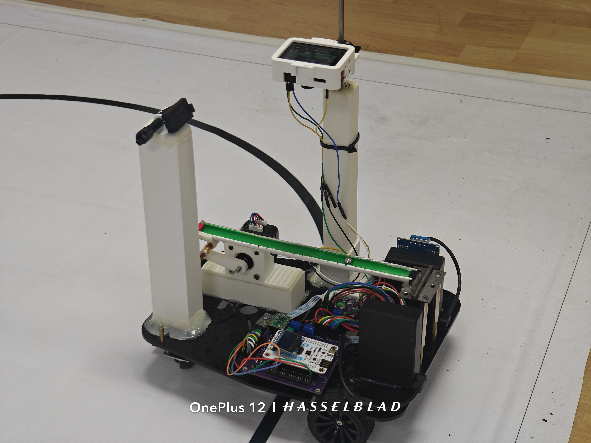
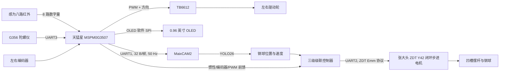

# 2026 NUEDC H 题：车载平衡滚球运动控制系统

本仓库面向《2026 年全国大学生电子设计竞赛赛区赛暨模拟电子系统设计专题赛选拔赛》H 题
“车载平衡滚球运动控制系统”。系统由一套 MSPM0G3507 两轮差速底盘和一套 MaixCAM2
视觉摆杆控制器组成：底盘沿黑色环线完成循迹、定距、计时和停车，视觉端检测钢球位置并驱动
ZDT 闭环步进电机，使钢球在静止或小车运动时保持在指定位置。

> 赛题原文：[H题_车载平衡滚球运动控制系统.pdf](./H题_车载平衡滚球运动控制系统.pdf)



## 赛题目标与仓库实现

| 赛题项目 | 本仓库对应实现 | 当前说明 |
| --- | --- | --- |
| 1. 图传显示与录像 | MaixCAM2 实时画面、检测框、位置和状态显示；独立训练集采集应用 | 代码提供实时画面，完整录像与回放需由 MaixVision/接收端完成 |
| 2. 20 s 内循线一圈并停回 A 点 | 底盘 `T2 FAST LAP` | 高速循迹、横线停车、编码器定距兜底和 22 s 安全超时 |
| 3. O -> +5 cm -> -5 cm，5 s 内完成 | MaixCAM2 `TASK3` | 配平、开环走位/闭环接管、两端误差统计和 -5 cm 末端保持 |
| 4. A 到 B，球保持中心 | 底盘 `T4 A TO B` + MaixCAM2 `HOLD` | G356 锁航向、编码器定距、视觉闭环；前馈默认关闭，需实车标定后启用 |
| 5. 30 s 内稳球循线一圈 | 底盘 `T5/6 STEADY` + MaixCAM2 `HOLD` | 柔和起停、连续圆弧控制、终点横线软停车 |
| 6. 任意指定位置稳球循线一圈 | 底盘 `T5/6 STEADY` + MaixCAM2 `Q6/HOLD` | `Q6` 读取当前球位作为保持目标 |
| 7. 其他 | 底盘 `T7 INFINITE`、诊断页、屏幕调参、安全保护 | 可调速度连续循迹，不自动按里程停车 |

上表说明代码路径，不等同于全部赛题指标已经通过实车验收。当前保留的 Keil 构建记录为
`0 Error(s), 0 Warning(s)`；惯性协议有 8 项主机测试通过。任务时间、停车偏差、控球误差、
图传录像完整性仍应在最终机械结构和比赛场地上复测。

当前 TASK3 离线动力学仿真中，标称参数下约 `3.60 s` 完成，+5 cm/-5 cm 误差约为
`0.13 cm/0.32 cm`；加入摩擦、测量噪声、20 FPS 和通信延迟后约 `3.85 s` 完成，误差约为
`0.43 cm/0.40 cm`。这些数值只用于回归控制逻辑，不代表真实摆杆、钢球和电机已达到赛题指标。

## 系统结构



控制分为两个各自闭环、弱耦合的实时系统。底盘闭环只负责车辆轨迹，MaixCAM2 闭环只负责
钢球位置；底盘通过单向串口发送惯性遥测，视觉端仅把它作为有界前馈叠加量。通信失效时，
视觉反馈仍可独立工作，不会让前馈接管主控制权。

## 功能与实现原理

### 1. 底盘循迹与比赛状态机

感为八路模块的 `L4 ... R4` 被映射为 `-3.5 ... +3.5` 的位置权重。程序对所有检测到
黑线的通道求加权平均，得到黑线相对车体中心的误差，再由任务专用 PID 生成差速转向量：

```text
line_error = sum(active[i] * weight[i]) / sum(active[i])
left_pwm   = base_pwm - steering
right_pwm  = base_pwm + steering
```

- 任务 2 使用高速参数和连续圆弧降速，避免半圆入口突然打舵。
- 任务 5/6 使用较低带宽、PWM 斜率限制和五次 S 曲线起停，减小车体加速度对钢球的扰动。
- 短暂全灭先保持上一周期输出，持续丢线后按历史方向找线，超过上限立即制动。
- 直线段可锁定 G356 当前航向作辅助；进入弯道或陀螺仪数据过期后自动解除，避免航向环与
  灰度循迹环互相对抗。

左右编码器采用正交中断计数，距离按下式计算：

```text
distance_mm = (|left_count| + |right_count|) / 2 * 204 / 730
```

A 点停车不是只看单帧“多路变黑”。程序先用里程进入终点窗口，再累计左右外侧探头扫过
5 cm 横线的证据；任务 5/6 确认后锁存当时左右轮输出并按 S 曲线软停。若横线漏检，任务 2
和任务 5/6 还有可调编码器距离兜底。

### 2. 视觉测量

MaixCAM2 加载仓库内的 YOLO26 `.mud/.axmodel` 模型，在摆杆区域检测钢球。每帧选择置信度
最高的目标，以检测框中心作为像素位置；`ball_position.py` 将目标中心投影到摆杆轴线，再把
轴线端点 `-12.5 cm ... +12.5 cm` 线性映射为物理坐标。自适应 alpha-beta 滤波器抑制
检测抖动并处理短时漏检，控制器内部再对滤波位置做低延迟差分测速。

### 3. 摆杆三级级联控制

`HOLD` 和 `TASK3` 使用独立参数与状态，但闭环结构相同：

```text
位置误差 -> 位置外环 + 制动限速 -> 目标球速 v_ref
球速误差 -> 速度环 + 加速度阻尼 -> 电机角速度 omega
omega + 惯性前馈 -> 软行程限幅 -> 积分 -> 电机绝对角度 theta
```

位置外环根据剩余距离限制目标球速，使钢球在到达目标前开始制动；速度环的 `KA` 项提供
相位超前，抑制穿越目标后的过冲。电机角速度积分得到绝对角度，因此机械零点的静态偏差可由
控制结构逐步形成配平倾角，不依赖很大的位置积分项。

最终命令经过软行程限幅、最大角速度、目标范围和卡球检测。默认使用 ZDT `0xFD` 绝对位置
模式：主机停发后电机停在最后目标，且比整数 RPM 的 `0xF6` 速度模式有更细的低速分辨率。
丢球时程序以有限角速度让摆杆回水平；卡球且已顶到软限位时主动停机，避免堵转拉低电源。

### 4. TASK3 混合控制状态机

任务 3 状态为 `ARM -> READY -> GO+5 -> GO-5 -> SETTLE -> DONE`。第一次按 `TASK3`
先在中心闭环配平，默认等待第二次确认后才开始计时。当前默认允许用反对称倾角轨迹快速完成
两段走位，再在目标附近交给级联闭环；开环轨迹不可行时自动回退到纯闭环。程序记录 +5 cm
真实折返点和 -5 cm 过冲/稳态误差，完成后继续锁定在 -5 cm，而不是释放摆杆。

### 5. 底盘惯性前馈

MSPM0 每 20 ms 发送一个 32 字节小端帧，包含三轴加速度、Roll/Pitch、Z 轴角速度、编码器
速度/加速度、前进/转向 PWM 和 PWM 变化率，末尾使用 CRC16-Modbus。MaixCAM2 只有在以下
条件全部满足时才使用前馈：开关已启用、处于 `HOLD`、识别到球、任务/运动状态正确、序号
更新且 CRC 正确、数据未超过 100 ms。任何条件失效，前馈在默认 350 ms 内平滑撤销。

协议详见 [底盘惯性前馈串口协议](./m0g3507小车底盘/App/inertia_telemetry_protocol.md) 和
[惯性前馈现场操作](./maixcam2/带前馈通信/惯性前馈_现场操作.md)。

## 硬件 BOM

| 模块 | 数量/作用 |
| --- | --- |
| 天猛星 MSPM0G3507 MCU 板 | 1，底盘主控、计时、任务调度和安全保护 |
| 感为八路红外循迹模块 | 1，八路数字量检测 1.8 cm 黑线 |
| TB6612 双路直流电机驱动模块 | 1，驱动左右轮电机 |
| 带正交编码器的左右轮电机 | 2，差速行驶和里程估计 |
| 逐飞无线串口模块 | 1，可选调试/遥测链路，和 Maix 前馈共用 UART1 |
| MaixCAM2 | 1，钢球检测、屏幕交互和摆杆控制 |
| G356 六轴陀螺仪 | 1，航向辅助与惯性量测 |
| 张大头/ZDT Y42 闭环步进电机及驱动 | 1，摆杆角度执行器 |
| 0.96 英寸 OLED（SSD1306 类） | 1，底盘模式、时间、距离和诊断显示 |
| 按键、车架、25 cm 凹槽摆杆、约 1 cm 钢球、电池与稳压模块 | 若干，按赛题机械要求配置 |

## 接线说明

### 接线总原则

1. MSPM0、MaixCAM2、G356、TB6612 逻辑侧和 ZDT 串口必须共信号地。
2. MSPM0/Maix 的 GPIO 与 UART 按 **3.3 V TTL 逻辑**连接，禁止直接接 RS-232 电平。
3. ZDT 电机动力电源与 MaixCAM2 分开供电；项目实机文档使用 24 V 电机电源。不要从
   MaixCAM2 的电池或 3.3 V 引脚给电机供电。
4. TB6612 的 `VM` 接电机电源，`VCC` 接与 MCU 兼容的逻辑电源，所有 `GND` 共地。
   程序没有分配 `STBY` 控制脚，因此 `STBY` 必须由模块板载上拉或外接拉高。
5. G356、OLED、循迹模块、编码器的供电电压以各自模块丝印/数据手册为准；信号输出必须
   与 3.3 V MCU 兼容。不要仅凭接口名称猜供电电压。

### MSPM0G3507 与八路循迹模块

| 循迹通道 | MSPM0 引脚 | 位置 |
| --- | --- | --- |
| L4 | PA12 | 最左外侧 |
| L3 | PA13 | 左外侧 |
| L2 | PA14 | 左中 |
| L1 | PA15 | 左内侧 |
| R1 | PA16 | 右内侧 |
| R2 | PA17 | 右中 |
| R3 | PA0 | 右外侧 |
| R4 | PA1 | 最右外侧 |

八路均为并行数字输入，当前代码按**低电平检测到黑线**，不使用 I2C。模块 `GND` 接主控
`GND`，电源按模块额定值连接。若左右安装顺序与表格相反，应先核对排线；软件统一方向参数是
`LINE_TRACKING_ERROR_DIRECTION_SIGN`，不要在多个控制层重复取反。

### MSPM0G3507、TB6612 与轮电机

| TB6612/编码器端 | MSPM0 引脚 | 说明 |
| --- | --- | --- |
| PWMA | PB2 / TIMG6_CCP0 | 左电机 PWM |
| AIN1 | PB18 | 左电机方向 1 |
| AIN2 | PB19 | 左电机方向 2 |
| A01/A02 | 左轮电机两端 | 若正反相反，可交换电机两线后重新检查编码器方向 |
| PWMB | PB3 / TIMG6_CCP1 | 右电机 PWM |
| BIN1 | PB20 | 右电机方向 1 |
| BIN2 | PB24 | 右电机方向 2 |
| B01/B02 | 右轮电机两端 | 同上 |
| 左编码器 A | PB0 | 双边沿 GPIO 中断 |
| 左编码器 B | PB1 | 正交方向判定 |
| 右编码器 A | PB7 | 双边沿 GPIO 中断 |
| 右编码器 B | PB6 | 正交方向判定 |

若模块把两路命名为 `A/B` 与实际左右相反，只需成组交换，不能把某一路 PWM 与另一侧方向脚
混接。首次上电应架空车轮，确认“正 PWM = 两轮同向前进”且前进时两路编码器里程都增加。

### MSPM0G3507 与 G356

| G356 | MSPM0 | 说明 |
| --- | --- | --- |
| TX | PA25 / UART3_RX | 必接，G356 向主控发送 56 字节遥测帧 |
| RX | PA26 / UART3_TX | 当前只收遥测时可不接 |
| GND | GND | 必须共地 |
| VCC | 按 G356 模块额定电压 | 信号必须为 3.3 V TTL 兼容 |

串口参数为 `115200, 8N1`。安装后进入底盘 `GYRO STATUS` 页检查有效帧计数持续增加，再把
当前车头方向设为软件零点。任务 4 没有有效 G356 数据时会停车，不会盲走。

### MSPM0G3507 与 OLED/按键

| OLED/按键 | MSPM0 引脚 | 说明 |
| --- | --- | --- |
| OLED SCK/SCL | PB9 | 软件 SPI 时钟 |
| OLED SDA/MOSI | PB8 | 软件 SPI 数据 |
| OLED RES | PB10 | 复位 |
| OLED DC | PB11 | 数据/命令选择 |
| OLED CS | PB14 | 片选 |
| 上键 | PB15 | 低电平有效、内部上拉 |
| 下键 | PB16 | 低电平有效、内部上拉 |
| 返回/急停 | PB17 | 低电平有效、内部上拉 |
| 确认/启动/急停 | PB21 | 板载按键，低电平有效、内部上拉 |

如果 OLED 模块只有四针 I2C 接口，则不能直接使用本工程的六/七针软件 SPI 接法。

### MSPM0G3507、MaixCAM2 与逐飞无线串口

MSPM0 的 UART1 为 `PA8 TX / PA9 RX, 115200 8N1`。当前固件虽然把实例命名为
`WIRELESS_UART`，但实际只通过 `PA8` 发送 50 Hz 惯性前馈，`PA9` 收到的数据会被丢弃。

**完整前馈接法（推荐用于任务 4/5/6）：**

| MSPM0 | MaixCAM2 | 说明 |
| --- | --- | --- |
| PA8 / UART1_TX | PA31 / UART1_RX（MaixPy 名称 `A31`） | 单向 32 字节惯性帧 |
| GND | GND | 必须共地 |
| PA9 / UART1_RX | 不接 | 当前协议不接收 Maix 命令 |

**逐飞无线串口调试接法：**

| MSPM0 | 逐飞无线串口 | 说明 |
| --- | --- | --- |
| PA8 / UART1_TX | RX | 无线端可观察同一二进制惯性帧 |
| PA9 / UART1_RX | TX | 当前固件会丢弃收到的数据，不能在线改参 |
| GND | GND | 必须共地 |
| VCC | 按模块额定电压 | 确认串口信号为 3.3 V TTL |

UART1 只有一套引脚。比赛完整接线时优先把 `PA8` 给 MaixCAM2；使用无线模块调试时关闭
Maix 端 `FF ON`，或者断开 Maix 前馈线。不要让两个模块的 TX 同时驱动 `PA9`，也不要在
未核对输入负载和电平前把 `PA8` 随意一分二。

### MaixCAM2 与 ZDT Y42 闭环步进电机

| MaixCAM2 | ZDT 驱动器 | 说明 |
| --- | --- | --- |
| B0 / UART2_TX | RX | 命令发送 |
| B1 / UART2_RX | TX | 状态回复 |
| GND | GND | 必须共地，线要短且可靠 |
| 独立供电 | 电机动力输入 | 项目实机使用 24 V；以电机/驱动铭牌为准 |

UART 参数为 `115200, 8N1`。代码假设电机地址 `1`、固定校验字节 `0x6B`、16 细分
（`3200 pulse/rev`）。改变地址、波特率或细分后必须同步修改 `zdt_motor.py`。上电运行程序前
先把摆杆调到水平，程序会将当前位置清零为 `0 deg`。方向未确认前不要放球闭环，先用
`probe.py`/`motor_diag.py` 小角度测试。

## 目录结构

```text
26NUEDC/
├─ H题_车载平衡滚球运动控制系统.pdf   # 赛题原文
├─ 小车实物.jpg                       # 实物照片
├─ m0g3507小车底盘/
│  ├─ User/empty.c                    # MCU 程序入口
│  ├─ App/competition_control.c       # 比赛任务状态机
│  ├─ App/vehicle_config.h            # 底盘集中标定参数
│  ├─ App/inertia_telemetry.c         # 50 Hz 惯性协议发送
│  ├─ Control/motion.c                # 循迹、航向与起停控制
│  ├─ Hardware/                       # 电机、编码器、灰度、G356、OLED、按键
│  ├─ empty.syscfg                    # 外设与引脚配置源
│  └─ keil/*.uvprojx                  # Keil uVision 工程入口
└─ maixcam2/
   ├─ 带前馈通信/                     # 当前推荐的完整视觉控制版本
   │  ├─ main.py                      # MaixPy 入口和模式调度
   │  ├─ cascade.py                   # HOLD 三级级联控制
   │  ├─ task3_ctrl.py                # 任务 3 控制器与状态机
   │  ├─ inertia_feedforward.py       # 惯性帧解析与有界前馈
   │  ├─ ball_position.py             # 像素到物理位置映射和滤波
   │  ├─ zdt_motor.py                 # ZDT Emm UART 协议
   │  └─ models/                      # MaixCAM2 YOLO26 模型
   ├─ 未加通信/                       # 不含底盘前馈的对照版本
   └─ 自动采集训练集/                 # 独立的定时拍照工具
```

## 构建与运行

### 底盘固件

1. 用 Keil uVision 打开
   `m0g3507小车底盘/keil/empty_LP_MSPM0G3507_nortos_keil.uvprojx`。
2. 选择 `MSPM0G3507_Project`，执行 Rebuild，要求 `0 Error(s), 0 Warning(s)`。
3. 使用与天猛星板匹配的下载器烧录。首次调试时架空车轮，先进入 `GYRO STATUS` 检查传感器。
4. 需要改引脚/外设时编辑 `empty.syscfg` 并重新生成；不要手工修改根目录的
   `ti_msp_dl_config.c/.h` 生成文件。

调车参数集中在 `m0g3507小车底盘/App/vehicle_config.h`。轮周长、每圈编码器计数、横线窗口、
定距停车值、各任务 PWM/PID 和软停时间必须按最终车辆重新标定。

### MaixCAM2 视觉应用

1. 在 MaixVision 中打开 `maixcam2/带前馈通信/`。
2. 先运行 `uart_pin_probe.py`，确认固件把 `A31` 暴露为 `UART1_RX`。
3. 不装球运行 `motor_diag.py`/`probe.py`，确认串口、电机方向、水平零点和机械行程。
4. 确认模型目录完整后运行 `main.py`。默认 `FF ON=0`，视觉闭环可独立启动。
5. 运行页使用 `HOLD`、`Q6`、`TASK3`、`STOP`、`ZERO`、`LIGHT` 和 `TUNE`；调参页通过
   `PAGE` 切换 `MAIN/TASK3`，`SAVE` 将参数保存到设备 `/root/*.json`。

更详细的现场步骤见 [视觉控制说明](./maixcam2/带前馈通信/README.md)、
[TASK3 现场操作](./maixcam2/带前馈通信/TASK3_现场操作.md) 和
[自动采集训练集说明](./maixcam2/自动采集训练集/README.md)。

## 上电与验收顺序

1. 断开动力电源，逐项用万用表确认供电极性、共地和 UART TX/RX 交叉关系。
2. 架空底盘，验证左右轮方向、编码器方向、急停按键和 OLED 计时。
3. 落地低速验证八路顺序、黑线低电平逻辑、丢线停车和 G356 有效帧。
4. 空摆杆验证 ZDT 通信、水平零点、方向和 80% 机械行程软限位，再放球调 `HOLD`。
5. 单独完成任务 3 的 +5/-5 cm 标定；屏幕同时检查耗时和两端最大误差。
6. 保持 `FF ON=0` 完成底盘低速稳球基线，再按 PWM -> 编码器 -> IMU 的顺序逐项加入前馈。
7. 在同一起点连续重复 5 至 10 次，记录时间、A 点停车偏差、±5 cm 误差、最大稳球误差、
   丢帧/CRC 数和异常停机原因。

## 已知边界

- 本仓库参数与现有实车绑定，换轮胎、减速电机、摆杆连杆比、摄像头位置或 ZDT 细分后必须重标定。
- `FF ON` 默认关闭；没有确认 G356 安装轴向、前馈符号和 UART 完整性前不要直接增大增益。
- 任务 1 的完整视频录制/回放由图传接收端承担，当前控制代码本身不保存比赛全程视频。
- 主机语法检查和离线仿真不能代替 MaixCAM2 NPU、触摸屏、真实电机、供电和场地测试。
- 仓库未附授权许可证；第三方使用前应先确认代码、TI DriverLib 和模型文件的许可条件。
